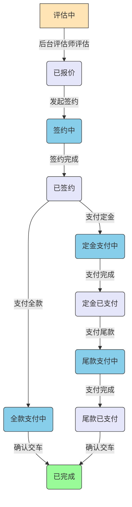

# 工单状态流转流程图

## 状态说明

1. **评估中**: 初始状态，销售顾问正在对车辆进行评估。
2. **已报价**: 评估完成后，系统生成报价，等待客户确认。
3. **签约中**: 客户已发起签约，但签约流程尚未完成（过程状态）。
4. **已签约**: 客户确认报价并签署合同。
5. **定金支付中**: 客户已发起定金支付，但支付流程尚未完成（过程状态）。
6. **定金已支付**: 客户支付定金（适用于分期付款方式）。
7. **全款支付中**: 客户已发起全款支付，但支付流程尚未完成（过程状态）。
8. **尾款支付中**: 客户已发起尾款支付，但支付流程尚未完成（过程状态）。
9. **尾款已支付**: 客户支付尾款。
10. **已完成**: 客户支付全款或确认交车，工单完成。

## 操作按钮与状态变更

- **完成评估并提交**: 从"评估中"状态提交评估结果，进入"已报价"状态。
- **发起签约**: 在"已报价"状态下，客户发起签约流程，状态变更为"签约中"。
- **签约完成**: 签约流程完成，状态从"签约中"变更为"已签约"。
- **支付定金**: 在"已签约"状态下，选择分期付款方式并支付定金，状态变更为"定金支付中"。
- **定金支付完成**: 定金支付流程完成，状态从"定金支付中"变更为"定金已支付"。
- **支付全款**: 在"已签约"状态下，选择一次性付款方式并支付全款，状态变更为"全款支付中"。
- **全款支付完成**: 全款支付流程完成，状态从"全款支付中"变更为"已完成"。
- **支付尾款**: 在"定金已支付"状态下，支付剩余尾款，状态变更为"尾款支付中"。
- **尾款支付完成**: 尾款支付流程完成，状态从"尾款支付中"变更为"尾款已支付"。
- **确认交车**: 在"尾款已支付"状态下，确认交车，状态变更为"已完成"。